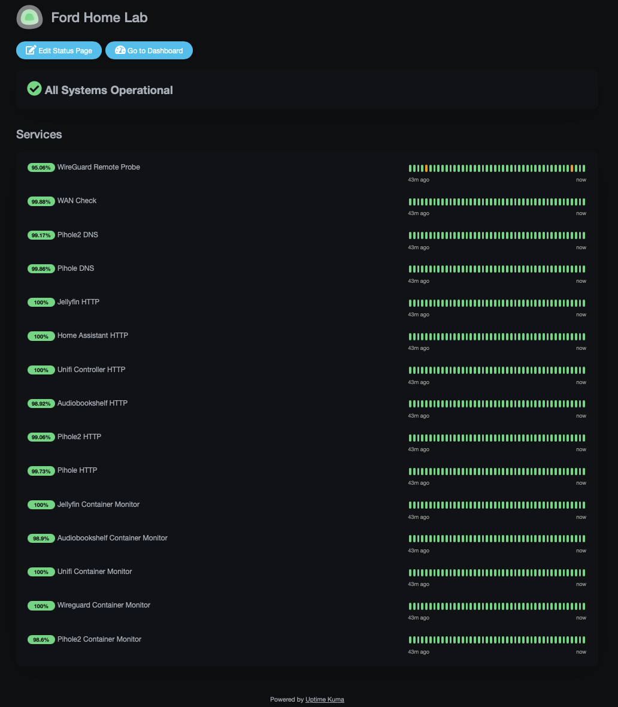
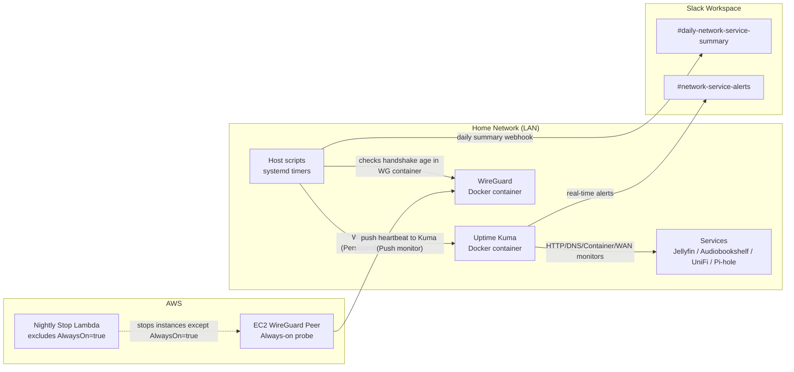

# homelab-monitoring-stack


> Infrastructure monitoring, alerting, and remote tunnel validation for a Docker-based homelab using Uptime Kuma, WireGuard, systemd timers, Slack, and AWS.

This repo is my “do it again” playbook: install Uptime Kuma, configure monitors + Slack, add an external WireGuard probe (EC2), and wire up host scripts + systemd timers.

<p align="center">
  
</p>

---

## Table of contents

- [Repo layout](#repo-layout)
- [Architecture](#architecture)
- [Uptime Kuma](#uptime-kuma)
  - [Install](#install)
  - [Slack notifications](#slack-notifications)
  - [Monitor inventory](#monitor-inventory)
  - [Recommended intervals and retries](#recommended-intervals-and-retries)
- [WireGuard remote probe (EC2)](#wireguard-remote-probe-ec2)
  - [Why an external probe](#why-an-external-probe)
  - [EC2 peer config notes](#ec2-peer-config-notes)
  - [Host-side probe script (push monitor)](#host-side-probe-script-push-monitor)
  - [systemd service + timer](#systemd-service--timer)
- [Daily Slack summary](#daily-slack-summary)
  - [Daily summary script](#daily-summary-script)
  - [systemd service + timer](#systemd-service--timer-1)
- [AWS nightly stop Lambda exclusion](#aws-nightly-stop-lambda-exclusion)
- [Recovery checklist](#recovery-checklist)

---
---

## Repo layout

```text
homelab-monitoring-stack/
├── README.md
├── scripts/
│   ├── wg-ec2-probe
│   └── homelab-daily-summary
├── systemd/
│   ├── wg-ec2-probe.service
│   ├── wg-ec2-probe.timer
│   ├── homelab-daily-summary.service
│   └── homelab-daily-summary.timer
└── aws/
    └── stop_ec2_instances_lambda.py
```

## Architecture



---

## Uptime Kuma

docker-compose.yml:

``` bash
version: "3"

services:
  uptime-kuma:
    image: louislam/uptime-kuma:latest
    container_name: uptime-kuma
    restart: always
    ports:
      - "3001:3001"
    volumes:
      - ./data:/app/data
      - /var/run/docker.sock:/var/run/docker.sock
```

Open:

- `http://<server-ip>:3001`

### Slack notifications

Create two Slack incoming webhooks:

- **Daily summaries** → `#daily-network-service-summary` (sent by host script, not Kuma)
- **Real-time alerts** → `#network-service-alerts` (sent by Kuma notifications)

In Kuma:

1. Settings → Notifications → Add → Slack
2. Paste webhook URL for **alerts** channel
3. Save and enable on monitors

### Monitor inventory

I use both *service-level* and *process-level* checks:

- **HTTP(s)**: Jellyfin, Audiobookshelf, UniFi, Pi-hole UI, Home Assistant
- **Docker Container**: jellyfin, audiobookshelf, unifi, pihole, pihole2, wireguard, etc.
- **DNS**: Pi-hole primary and secondary resolvers
- **WAN**: ping to a stable anycast target (recommend `1.1.1.1`; optionally add `8.8.8.8` as a second WAN monitor)
- **Push**: WireGuard remote probe heartbeat (from host script)

### Recommended intervals and retries

| Category | Interval | Retries | Notes |
|---|---:|---:|---|
| HTTP | 60s | 2 | Fast, but not twitchy |
| Containers | 60s | 1 | “Process alive” safety net |
| DNS | 30–60s | 2 | High-value signal (clients depend on it) |
| WAN | 60s | 4–5 | Avoid ISP flap noise |
| WireGuard remote probe | 60s push | 1 | End-to-end tunnel validation (EC2 ↔ home) |

---

## WireGuard remote probe (EC2)

### Why an external probe

A local “container running” check doesn’t prove remote access works.

The EC2 peer + handshake-age probe validates:

- public IP reachability
- router port-forward / firewall correctness
- WireGuard negotiation + routing
- tunnel stays usable even when no personal devices are connected

### EC2 peer config notes

On the EC2 instance:

- Use **split tunnel** (do **not** use `0.0.0.0/0` on EC2 or you’ll break SSH routing)
- Add keepalive under the `[Peer]` block:

```ini
PersistentKeepalive = 25
```

Verify on EC2:

```bash
sudo wg show wg0
# Look for:
# persistent keepalive: every 25 seconds
# latest handshake: <recent>
```

Security group for the EC2 peer (minimal):

- Inbound: SSH 22 from **only** your IP (or none if using SSM/other management)
- Outbound: default allow is fine (SGs are stateful; return UDP traffic is allowed)

### Host-side probe script (push monitor)

This script runs on the homelab host (`infra01`). It checks the **latest handshake age** for the EC2 peer **from inside the WireGuard container**, and only “pings” Kuma when healthy.

**File:** [scripts/wg-ec2-probe](./scripts/wg-ec2-probe) (install to `/usr/local/bin/wg-ec2-probe`)

In Kuma:

1. Add Monitor → **Push**
2. Set heartbeat interval to **60s**
3. Copy the push URL token into `PUSH_BASE`

### systemd service + timer

**File:** [systemd/wg-ec2-probe.service](./systemd/wg-ec2-probe.service)

**File:** [systemd/wg-ec2-probe.timer](./systemd/wg-ec2-probe.timer)

Install & enable:

```bash
sudo install -m 0755 scripts/wg-ec2-probe /usr/local/bin/wg-ec2-probe
sudo install -m 0644 systemd/wg-ec2-probe.service /etc/systemd/system/wg-ec2-probe.service
sudo install -m 0644 systemd/wg-ec2-probe.timer /etc/systemd/system/wg-ec2-probe.timer

sudo systemctl daemon-reload
sudo systemctl enable --now wg-ec2-probe.timer
systemctl list-timers --all | grep wg-ec2-probe
```

---

## Daily Slack summary

A daily “all systems healthy” post goes to `#daily-network-service-summary`. This is run on the host via systemd timer.

### Daily summary script

**File:** [scripts/homelab-daily-summary](./scripts/homelab-daily-summary) (install to `/usr/local/bin/homelab-daily-summary`)

**Env file:** `/etc/homelab/healthcheck.env` (mode 600)

```bash
KUMA_BASE_URL=http://127.0.0.1:3001
KUMA_SLUG=homelab
SLACK_WEBHOOK_URL=https://hooks.slack.com/services/XXX/YYY/ZZZ
```

Permissions:

```bash
sudo chown root:root /usr/local/bin/homelab-daily-summary
sudo chmod 755 /usr/local/bin/homelab-daily-summary
sudo chmod 600 /etc/homelab/healthcheck.env
```

Test:

```bash
sudo /usr/local/bin/homelab-daily-summary
```

### systemd service + timer

**File:** [systemd/homelab-daily-summary.service](./systemd/homelab-daily-summary.service)

**File:** [systemd/homelab-daily-summary.timer](./systemd/homelab-daily-summary.timer)

Install & enable:

```bash
sudo install -m 0755 scripts/homelab-daily-summary /usr/local/bin/homelab-daily-summary
sudo install -m 0644 systemd/homelab-daily-summary.service /etc/systemd/system/homelab-daily-summary.service
sudo install -m 0644 systemd/homelab-daily-summary.timer /etc/systemd/system/homelab-daily-summary.timer

sudo systemctl daemon-reload
sudo systemctl enable --now homelab-daily-summary.timer
systemctl list-timers --all | grep homelab-daily-summary
```

---

## AWS nightly stop Lambda exclusion

My nightly “stop instances” Lambda excludes the monitoring EC2 instance via tag:

- `AlwaysOn = true`

Use Python **3.13** runtime or greater.

**File:**: [aws/stop_ec2_instances_lambda.py](./aws/stop_ec2_instances_lambda.py)

---

## Recovery checklist

If rebuilding from scratch:

1. Deploy Uptime Kuma container
2. Create monitors + status page (`KUMA_SLUG`)
3. Configure Slack alert webhook in Kuma
4. Create Push monitor for WireGuard remote probe; copy token
5. Stand up EC2 peer, confirm keepalive and handshakes
6. Install scripts to `/usr/local/bin/`
7. Install systemd unit + timer files
8. Enable timers and verify heartbeats in Kuma
9. Run a test failure (stop `wireguard` container) and confirm Slack alert + recovery

---

*Generated on 2026-02-12.*
