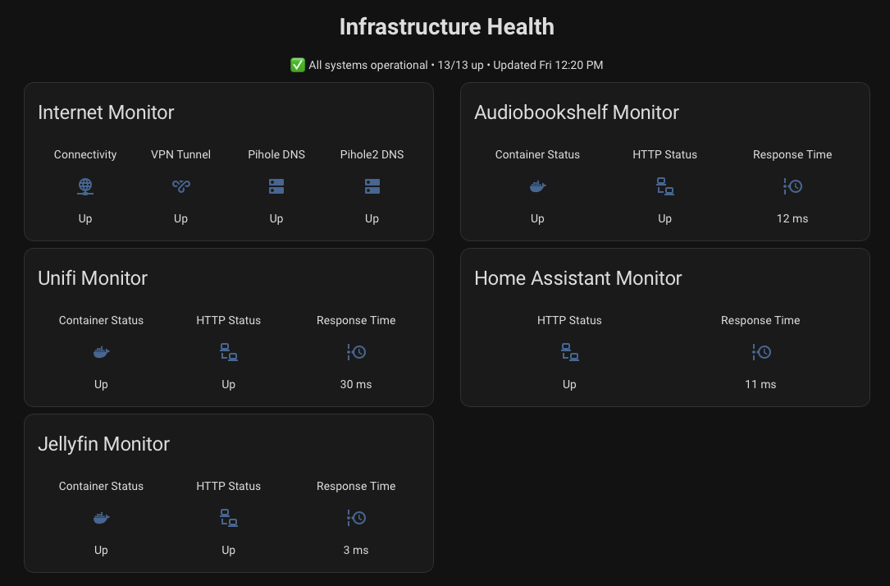
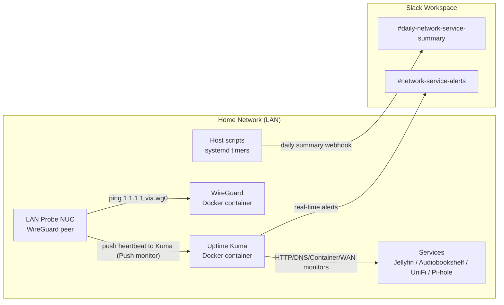
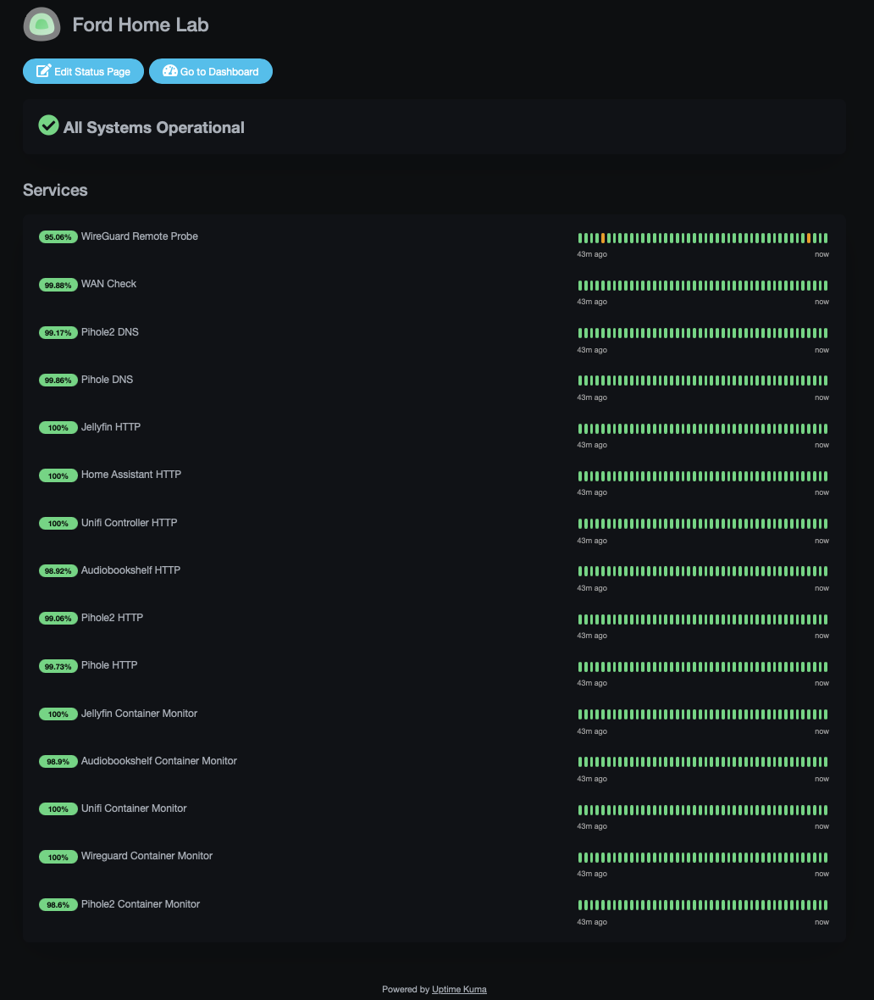
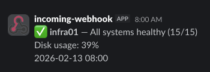
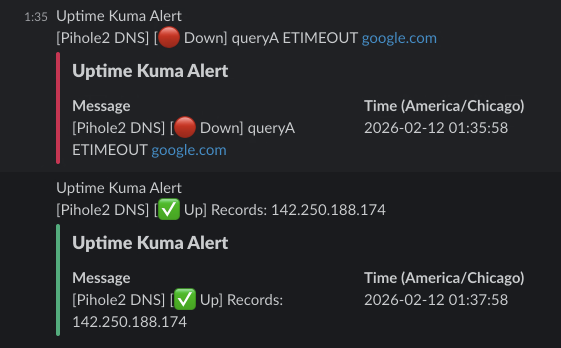

# homelab-monitoring-stack


> Infrastructure monitoring, alerting, and remote tunnel validation for a Docker-based homelab using Uptime Kuma, WireGuard, systemd timers, and Slack.

This repo is my “do it again” playbook: install Uptime Kuma, configure monitors + Slack, add a LAN WireGuard probe (NUC peer), and wire up host scripts + systemd timers.

<p align="center">
  
</p>

---

## Table of contents

- [Repo layout](#repo-layout)
- [Architecture](#architecture)
- [Uptime Kuma](#uptime-kuma)
  - [Install](#install)
  - [Slack notifications](#slack-notifications)
  - [Monitor inventory](#monitor-inventory)
  - [Recommended intervals and retries](#recommended-intervals-and-retries)
- [WireGuard LAN probe](#wireguard-lan-probe)
  - [Why a dedicated LAN probe](#why-a-dedicated-lan-probe)
  - [Host-side probe script (push monitor)](#host-side-probe-script-push-monitor)
  - [systemd service + timer](#systemd-service--timer)
- [Daily Slack summary](#daily-slack-summary)
  - [Daily summary script](#daily-summary-script)
  - [systemd service + timer](#systemd-service--timer-1)
- [AWS nightly stop Lambda exclusion](#aws-nightly-stop-lambda-exclusion)
- [Prometheus + Grafana metrics stack](#prometheus--grafana-metrics-stack)
  - [Architecture and port map](#architecture-and-port-map)
  - [Bringing the stack up](#bringing-the-stack-up)
  - [Accessing Grafana](#accessing-grafana)
  - [Onboarding a new scrape target](#onboarding-a-new-scrape-target)
  - [Monitoring a SteamOS gaming PC](#monitoring-a-steamos-gaming-pc)
- [Recovery checklist](#recovery-checklist)

---
---

## Repo layout

```text
homelab-monitoring-stack/
├── README.md
├── scripts/
│   ├── wg-lan-probe
│   └── homelab-daily-summary
├── systemd/
│   ├── wg-lan-probe.service
│   ├── wg-lan-probe.timer
│   ├── homelab-daily-summary.service
│   └── homelab-daily-summary.timer
├── docker/
│   ├── prometheus/                         # compose + scrape config
│   └── grafana/                            # compose + provisioning
├── gaming-pc-monitoring/
│   ├── README.md                           # full SteamOS monitoring guide (shareable)
│   ├── install-node-exporter.sh            # Node Exporter installer for SteamOS
│   └── node_exporter.service               # systemd *user* unit for SteamOS
└── aws/
    └── stop_ec2_instances_lambda.py
```

> **Note:** the Prometheus and Grafana compose files follow this server's
> `~/docker/<application>` convention. The copies under `docker/` here are for
> reference/version control; the live files the containers run from are at
> `~/docker/prometheus/` and `~/docker/grafana/`.

## Architecture


```mermaid
flowchart LR
  subgraph Home["Home Network (LAN)"]
    KU[Uptime Kuma<br/>Docker container]
    WG[WireGuard<br/>Docker container]
    SVC[Services<br/>Jellyfin / Audiobookshelf / UniFi / Pi-hole]
    SYS[Host scripts<br/>systemd timers]
    NUC[LAN Probe NUC<br/>WireGuard peer]
  end

  subgraph Slack["Slack Workspace"]
    CH1["#daily-network-service-summary"]
    CH2["#network-service-alerts"]
  end

  KU -- "HTTP/DNS/Container/WAN monitors" --> SVC
  KU -- "real-time alerts" --> CH2
  SYS -- "daily summary webhook" --> CH1

  NUC -- "ping 1.1.1.1 via wg0" --> WG
  NUC -- "push heartbeat to Kuma (Push monitor)" --> KU
```

---

## Uptime Kuma

<p align="center">
  
</p>

Uptime Kuma is a clean, self-hosted monitoring tool that keeps an eye on all of your services. It can monitor:

- HTTP(S) availability  
- TCP services  
- DNS resolvers  
- Container health  

It also [integrates with Home Assistant](https://www.home-assistant.io/integrations/uptime_kuma/), allowing you to add monitor statuses directly to your dashboard (shown in the image at the top of this repository).

### Installation with docker-compose

docker-compose.yml:

``` bash
version: "3"

services:
  uptime-kuma:
    image: louislam/uptime-kuma:latest
    container_name: uptime-kuma
    restart: always
    ports:
      - "3001:3001"
    volumes:
      - ./data:/app/data
      - /var/run/docker.sock:/var/run/docker.sock
```

Open:

- `http://<server-ip>:3001`

### Slack notifications

Create two Slack incoming webhooks:

<p align="center">
  
</p>

**Daily summaries** → `#daily-network-service-summary`  
(sent by host script, not Kuma)

<p align="center">
  
</p>

**Real-time alerts** → `#network-service-alerts`  
(sent by Kuma notifications)

In Kuma:

1. Settings → Notifications → Add → Slack
2. Paste webhook URL for **alerts** channel
3. Save and enable on monitors

### Monitor inventory

I use both *service-level* and *process-level* checks:

- **HTTP(s)**: Jellyfin, Audiobookshelf, UniFi, Pi-hole UI, Home Assistant
- **Docker Container**: jellyfin, audiobookshelf, unifi, pihole, pihole2, wireguard, etc.
- **DNS**: Pi-hole primary and secondary resolvers
- **WAN**: ping to a stable anycast target (recommend `1.1.1.1`; optionally add `8.8.8.8` as a second WAN monitor)
- **Push**: WireGuard remote probe heartbeat (from host script)

### Recommended intervals and retries

| Category | Interval | Retries | Notes |
|---|---:|---:|---|
| HTTP | 60s | 2 | Fast, but not twitchy |
| Containers | 60s | 1 | “Process alive” safety net |
| DNS | 30–60s | 2 | High-value signal (clients depend on it) |
| WAN | 60s | 4–5 | Avoid ISP flap noise |
| WireGuard remote probe | 60s push | 1 | WireGuard tunnel + outbound internet validation (LAN NUC via wg0) |

---

## WireGuard LAN probe

### Why a dedicated LAN probe

A local “container running” check doesn’t prove the tunnel is actually carrying traffic.

A NUC peer on the LAN running a ping through `wg0` validates:

- WireGuard container health
- tunnel routing
- outbound internet connectivity through the tunnel

…without requiring any cloud infrastructure.

### Host-side probe script (push monitor)

This script runs on a dedicated LAN NUC that is configured as a WireGuard peer. It pings `1.1.1.1` through `wg0`, and only “pings” Kuma when the ping succeeds.

**File:** [scripts/wg-lan-probe](./scripts/wg-lan-probe) (install to `/usr/local/bin/wg-lan-probe`)

In Kuma:

1. Add Monitor → **Push**
2. Set heartbeat interval to **60s**
3. Copy the push URL token into `PUSH_BASE`

### systemd service + timer

**File:** [systemd/wg-lan-probe.service](./systemd/wg-lan-probe.service)

**File:** [systemd/wg-lan-probe.timer](./systemd/wg-lan-probe.timer)

Install & enable:

```bash
sudo install -m 0755 scripts/wg-lan-probe /usr/local/bin/wg-lan-probe
sudo install -m 0644 systemd/wg-lan-probe.service /etc/systemd/system/wg-lan-probe.service
sudo install -m 0644 systemd/wg-lan-probe.timer /etc/systemd/system/wg-lan-probe.timer

sudo systemctl daemon-reload
sudo systemctl enable --now wg-lan-probe.timer
systemctl list-timers --all | grep wg-lan-probe
```

---

## Daily Slack summary

A daily “all systems healthy” post goes to `#daily-network-service-summary`. This is run on the host via systemd timer.

### Daily summary script

**File:** [scripts/homelab-daily-summary](./scripts/homelab-daily-summary) (install to `/usr/local/bin/homelab-daily-summary`)

**Env file:** `/etc/homelab/healthcheck.env` (mode 600)

```bash
KUMA_BASE_URL=http://127.0.0.1:3001
KUMA_SLUG=homelab
SLACK_WEBHOOK_URL=https://hooks.slack.com/services/XXX/YYY/ZZZ
```

Permissions:

```bash
sudo chown root:root /usr/local/bin/homelab-daily-summary
sudo chmod 755 /usr/local/bin/homelab-daily-summary
sudo chmod 600 /etc/homelab/healthcheck.env
```

Test:

```bash
sudo /usr/local/bin/homelab-daily-summary
```

### systemd service + timer

**File:** [systemd/homelab-daily-summary.service](./systemd/homelab-daily-summary.service)

**File:** [systemd/homelab-daily-summary.timer](./systemd/homelab-daily-summary.timer)

Install & enable:

```bash
sudo install -m 0755 scripts/homelab-daily-summary /usr/local/bin/homelab-daily-summary
sudo install -m 0644 systemd/homelab-daily-summary.service /etc/systemd/system/homelab-daily-summary.service
sudo install -m 0644 systemd/homelab-daily-summary.timer /etc/systemd/system/homelab-daily-summary.timer

sudo systemctl daemon-reload
sudo systemctl enable --now homelab-daily-summary.timer
systemctl list-timers --all | grep homelab-daily-summary
```

---

## AWS nightly stop Lambda exclusion

My nightly “stop instances” Lambda excludes the monitoring EC2 instance via tag:

- `AlwaysOn = true`

Use Python **3.13** runtime or greater.

**File:**: [aws/stop_ec2_instances_lambda.py](./aws/stop_ec2_instances_lambda.py)

> Note: The EC2 probe peer has been decommissioned in favour of the LAN NUC probe. The Lambda is retained here for any future EC2 usage.

---

## Prometheus + Grafana metrics stack

Where Uptime Kuma answers *"is it up?"*, Prometheus + Grafana answer *"how is it
doing?"* — time-series hardware and service metrics (CPU, RAM, disk, network,
temperatures) with 90 days of history and graphable dashboards.

The compose files live under the server's `~/docker/<application>` convention:

- `~/docker/prometheus/` — Prometheus compose + `prometheus.yml` scrape config
- `~/docker/grafana/` — Grafana compose + auto-provisioning (`provisioning/`)

### Architecture and port map

```text
┌──────────────────────────────┐         ┌─────────────────────────┐
│  infra01 (homelab server)    │ scrape  │  SteamOS gaming PC      │
│  Prometheus  :9090  ◀────────┼────15s──┤  Node Exporter  :9100   │
│      ▲ localhost:9090        │         │  (runs as deck user)    │
│  Grafana     :3000           │         └─────────────────────────┘
└──────────────────────────────┘
```

Both containers use **host networking** (`network_mode: host`). This is a
deliberate choice that satisfies "don't create a new Docker network":

- They share the host's network namespace — no new bridge network is created.
- Grafana reaches Prometheus at `localhost:9090`.
- Prometheus scrapes the SteamOS PC over the LAN at `<STEAMOS_PC_IP>:9100`.

| Service | Port | Status on this host |
|---|---:|---|
| Prometheus | `9090` | free — no conflict |
| Grafana | `3000` | free — no conflict |

Ports already in use that we checked against (`docker ps` / `ss -tlnp`): 22, 53,
80, 139, 445, 3001 (uptime-kuma), 5006 (actual-budget),
6789/8080/8443/8843/8880 (unifi), 8001 (tronbyt), 8096 (jellyfin),
9000/9443 (portainer), 13378 (audiobookshelf).

Persistent data uses **named Docker volumes** (survive container recreation):

- `prometheus_prometheus_data` — TSDB, capped at **90 days** retention
  (`--storage.tsdb.retention.time=90d`).
- `grafana_grafana_data` — Grafana DB (users, dashboards, settings).

### Bringing the stack up

Start Prometheus first so the data source is live when Grafana provisions itself:

```bash
cd ~/docker/prometheus && docker compose up -d
cd ~/docker/grafana    && docker compose up -d
docker ps --filter name=prometheus --filter name=grafana
```

### Accessing Grafana

Open **`http://<HOMELAB_SERVER_IP>:3000`**. Default login `admin` / `admin` —
**change it on first login** (or set `GF_SECURITY_ADMIN_PASSWORD` before first
start). The Prometheus data source is **auto-provisioned**, so no manual setup is
needed. For a full host dashboard, import **Node Exporter Full** (Grafana.com ID
**1860**): *Dashboards → New → Import → 1860*.

### Onboarding a new scrape target

1. Install an exporter on the target (Node Exporter listens on `9100`).
2. Add a job to `~/docker/prometheus/prometheus.yml`:

   ```yaml
     - job_name: "my-new-host"
       static_configs:
         - targets: ["<NEW_HOST_IP>:9100"]
           labels:
             host: "my-new-host"
   ```

3. Apply the change by **restarting** Prometheus:

   ```bash
   cd ~/docker/prometheus && docker compose restart prometheus
   ```

   > **Why restart instead of hot-reload?** `prometheus.yml` is bind-mounted as a
   > single file. Editors that save atomically (vim, VS Code, `sed -i`) replace
   > the file's inode, but the container stays bound to the *old* inode — so a
   > `curl -X POST http://localhost:9090/-/reload` would re-read stale content and
   > silently miss your edit. A `docker compose restart` re-binds the mount to the
   > current file. (Hot-reload only works reliably if you edit the file in place,
   > e.g. `sed -i` is *not* in place — prefer the restart.)

4. Confirm the target is `UP` at `http://<HOMELAB_SERVER_IP>:9090/targets`.

### Monitoring a SteamOS gaming PC

The first scrape target is a SteamOS PC (referenced generically as
`steamos-pc`). Because SteamOS has a read-only root filesystem, Node Exporter is
installed under `/home/deck/` and run as a systemd **user** service so it
survives system updates and reboots. The full, shareable walkthrough lives in
[`gaming-pc-monitoring/README.md`](gaming-pc-monitoring/README.md), with the
installer at
[`gaming-pc-monitoring/install-node-exporter.sh`](gaming-pc-monitoring/install-node-exporter.sh).

---

## Recovery checklist

If rebuilding from scratch:

1. Deploy Uptime Kuma container
2. Create monitors + status page (`KUMA_SLUG`)
3. Configure Slack alert webhook in Kuma
4. Install WireGuard on the LAN probe NUC, add as a peer, confirm handshake
5. Create Push monitor for WireGuard LAN probe; copy token
6. Install `wg-lan-probe` script and systemd units on the NUC
7. Install `homelab-daily-summary` script and systemd units on the host
8. Enable timers and verify heartbeats in Kuma
9. Run a test failure (stop `wireguard` container) and confirm Slack alert + recovery

---

*Generated on 2026-02-12.*
